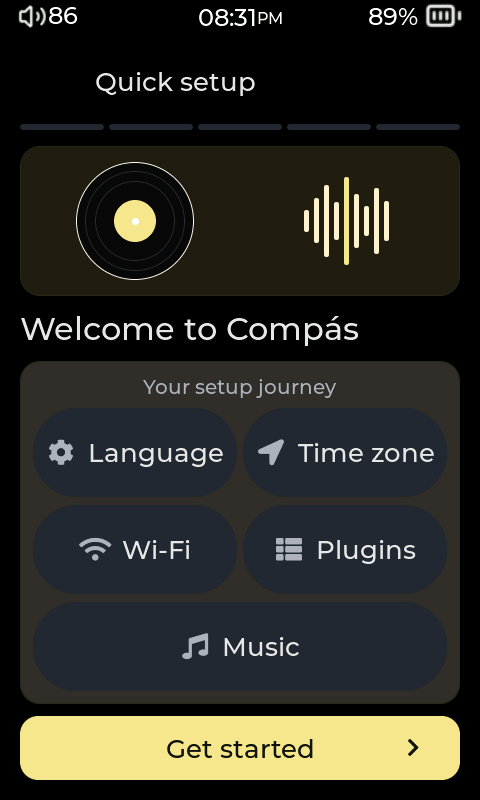
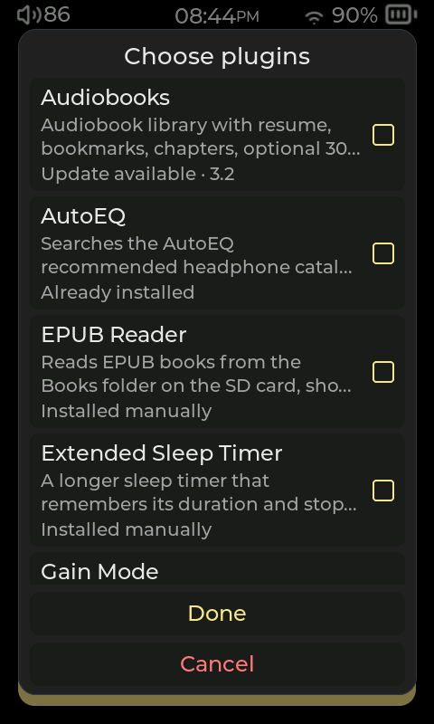
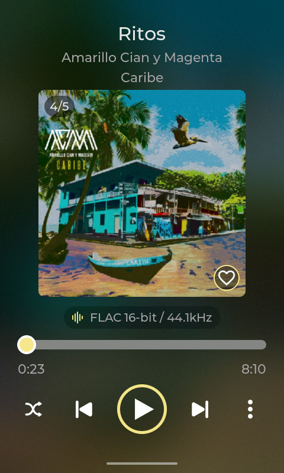
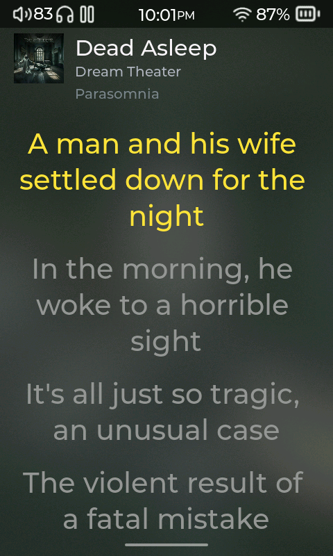
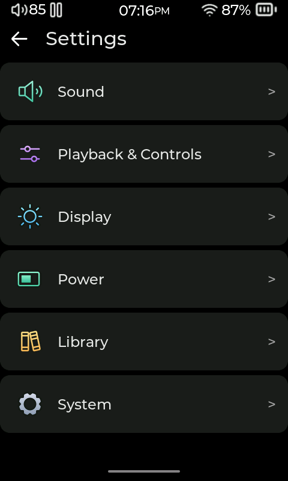

# Compás Player

<p align="center">
  <strong>A community-built music player for HiBy devices, with room to make it your own.</strong><br>
  Open source · Touch-friendly · Extendable with Lua plugins
</p>

<p align="center">
  <a href="LICENSE"></a>
  <a href="https://github.com/Starnished66/compas-player/releases/latest"></a>
  <a href="https://github.com/Starnished66/compas-plugins"></a>
</p>

<p align="center">
  <a href="#see-the-player">Screenshots</a> ·
  <a href="#quick-setup">Quick setup</a> ·
  <a href="#plugins">Plugins</a> ·
  <a href="#install-and-update">Installation</a> ·
  <a href="#build-from-source">Build from source</a>
</p>

Compás Player is an open-source replacement for HiBy OS's closed-source `hiby_player`, written in C with [LVGL](https://lvgl.io/). It is usable on real HiBy R1 hardware. Builds also exist for the R3 Pro II and R3 II 2025, but those builds have not been tested on their target hardware.

## Get started

1. Check the [device support notes](#device-support) and make sure the build is for your exact model.
2. If this is your first install, follow [First install](#first-install-full-firmware) to flash the full firmware package once.
3. For later player updates, download the matching player binary from [the latest release](https://github.com/Starnished66/compas-player/releases/latest) and copy it to `SD/.compas/compas_player`. See [Player-only update](#player-only-update) for details.
4. Browse and install add-ons in **Settings → System → Plugin Manager → Plugin Store**, or visit the [compas-plugins catalog](https://github.com/Starnished66/compas-plugins).

The first full firmware install replaces part of the device firmware. Keep a known-good recovery image and read the device-specific notes before flashing.

## See the player

Captured on a HiBy R1 running the current development build; published releases may have a different interface.

Browse the [full UI walkthrough](Screenshots/2026-10-01/README.md) for coverage and findings. Download or clone the repository and open [`Screenshots/2026-10-01/index.html`](Screenshots/2026-10-01/index.html) locally for the complete gallery, including menus, plugins and board layout previews.

**Welcome & plugin selection**

<p>
  
  
</p>

**Now Playing · Lyrics · Settings**

<p>
  
  
  
</p>

## Quick setup

A fresh install or factory reset opens a guided setup, starting with a short musical welcome animation.

1. **Language:** choose the language used throughout setup and the player.
2. **Time zone:** select your region with a map preview.
3. **Wi-Fi:** pick an available network or add a hidden network.
4. **Plugins:** select suggested Gain Mode and AutoEQ plugins, or open **More** to browse the live Plugin Store catalog and its descriptions. Confirm your selection and follow installation progress.
5. **Your music:** scan the SD card to build your library, then continue to the main screen.

Wi-Fi and plugins can be skipped and configured later. Failed plugin installations get one retry, with any remaining failures shown before setup finishes.

## What it can do

- **Play music:** FLAC, MP3, WAV, AIFF, DSD, AAC, ALAC, APE, Opus and more; gapless playback, crossfade, ReplayGain, a 10-band PEQ, queue controls, hardware buttons, Bluetooth audio and USB DAC mode.
- **Organize a library:** browse files, artists, albums and playlists; scan incrementally; use Rockbox tagcache; read synced lyrics and plain-text books; handle SD card removal and insertion. Audiobook features are available as a plugin.
- **Connect and stream:** Subsonic-compatible streaming over HTTPS, downloads, DLNA renderer, AirPlay through stock protocols where possible, Wi-Fi and Bluetooth remote control, and Wi-Fi music import.
- **Tune the device:** charge limit and Safe Charging, suspend or idle shutdown, car mode, USB Storage/DAC/ADB selector, timezone and charge LED controls.
- **Shape the interface:** swipe navigation, quick controls, themes, a customizable Home screen and non-Latin text including Cyrillic, Japanese, Korean and Thai.

Android client authors can use the [Remote Control API v1 contract](docs/REMOTE_CONTROL_API.md).

## Plugins

Plugins add screens, settings, themes, streaming sources and other features using Lua. Install a ready-made plugin through the on-device Plugin Store or download it from the [compas-plugins repository](https://github.com/Starnished66/compas-plugins). The Store catalog is published as [`index.json`](https://github.com/Starnished66/compas-plugins/releases/latest/download/index.json); packaged plugin downloads are attached to [the latest catalog release](https://github.com/Starnished66/compas-plugins/releases/latest).

Start with **AutoEQ** for downloadable headphone EQ profiles, **Gain Mode** for low/high gain controls, **Audiobooks** for bookmarks and listening progress, or **Podcasts** and **EPUB Reader** for more ways to enjoy your library. Browse the repository for the full catalog and each plugin's requirements.

For manual installation, follow the [plugins repository's installation instructions](https://github.com/Starnished66/compas-plugins#installing-by-hand): copy the `.lua` file to `SD/.plugins/` and any companion files to the destinations listed in its `store.json`. Then choose **Refresh Plugins** in **Settings → System → Plugin Manager** or restart the player. Plugins can be enabled or disabled without removing their files. No C toolchain, player rebuild or firmware reflash is needed.

Developers can start with the [plugin API guide](PLUGINS.md) and examples in [`plugins_examples/`](plugins_examples/). The guide documents the versioned `plugin.*` API for UI extensions, playback, library access, HTTP, themes and PEQ. For Now Playing layout customization, see [Player layouts](docs/PLAYER_LAYOUTS.md).

## Device support

| Device | Build target | Screen | Status |
| --- | --- | ---: | --- |
| HiBy R1 | `r1` (default) | 480×800 | Supported and actively tested on real hardware, including display, touch, audio, buttons, Bluetooth and Wi-Fi. |
| HiBy R3 Pro II | `r3proii` | 480×720 | Board-specific build exists; not tested on R3 Pro II hardware. Not an R1 binary. |
| HiBy R3 II 2025 | `r3ii_2025` | 320×480 | Board-specific build exists; not tested on R3 II 2025 hardware. Not an R1 binary. |

Other HiBy models are not supported unless explicitly listed and tested. Build output names for R3 models have a board suffix so they do not overwrite R1 binaries.

## Install and update

### First install: full firmware

The full `.upt` package installs the open-source bootloader and the complete firmware image. This step is required once before player-only updates will work. On stock firmware, the SD card update path is not read.

Download the R1 `r1.upt` from [releases](https://github.com/Starnished66/compas-player/releases/latest), keep a known-good recovery image, and install the package using the device's recovery updater. Use only an image intended for your model. The full package includes repository-tracked UI assets, fonts and `firmware/overlay/` files, along with the firmware files from its approved base image.

### Full firmware updates in Compás

Open **Settings → System → About → Firmware Update**. Online updates use only GitHub's designated latest published weekly release, with no fallback to older releases. A saved online download requires Wi-Fi when installing so the player can check that it still matches the latest release.

For an offline update, place one firmware file in the SD card root, named `r1.upt`, `r3proii.upt`, or `r3ii_2025.upt` for your model, then choose **Install from SD card**. The player checks the package structure and chunk checksums before preparing recovery. Renaming another model's image does not make it compatible.

Preparation runs in the background and records its phases and helper output in `SD/.compas/ota/update.log`. If preparation takes longer than expected, keep the player powered and wait: flash helpers are allowed to finish rather than being interrupted. Recovery performs the actual firmware installation after reboot.

### Player-only update

After the open-source bootloader is installed, use this for normal player updates. Download the player binary for your exact board from [the latest release](https://github.com/Starnished66/compas-player/releases/latest), or build it yourself, then copy it to this exact SD-card path:

```text
SD/.compas/compas_player
```

Keep the existing `.compas` directory and place the binary inside it. Reboot; the bootloader copies the new player into internal storage. **A player-only binary update does not include updated assets, fonts or firmware overlay files.** If an update requires those files, install a new full firmware image.

Older bootloaders look for `SD/.open_hiby_player/open_hiby_player`. Flash a current full `.upt` once to switch to the `.compas` path. Older installations may also have `/usr/bin/open_hiby_bootloader`; the current full image installs `/usr/bin/compas_bootloader` and updates the wrapper that starts it.

During the compatibility window, each mount migrates up to 256 top-level entries from `SD/.open_hiby_player` to `SD/.compas`, excluding database and bootloader entries. Remaining entries are retried on a later boot or card reinsertion. Existing destinations are preserved so retries are safe; large cache directories are renamed in constant time when the destination is absent. Archived database files and stock/update bootloader artifacts remain in the old directory. This migration is planned for removal after the compatibility window.

## Build from source

The host simulator is the quickest way to explore the interface. On Arch Linux, install `sdl2`, `make`, `gcc`/`g++` and `git`; `make` fetches LVGL when needed:

```sh
make
./compas_player_host
```

Click and drag in the SDL2 window to simulate touch. Stock graphics are not redistributed. To populate the local simulator asset mirror, copy `theme2` assets from your own firmware dump into `assets/theme2/`; these ignored stock files are not packaged or committed.

Target builds use a static MIPS musl toolchain (`mipsel-linux-musl-gcc`). On Arch Linux, install it with `yay -S mipsel-linux-musl-cross`, then build the selected board:

```sh
make target                 # R1: compas_player_target
make target BOARD=r3proii   # R3 Pro II: compas_player_target_r3proii
make target BOARD=r3ii_2025 # R3 II 2025: compas_player_target_r3ii_2025
```

<details>
<summary>Advanced firmware packaging and release workflow</summary>

### Build a `.upt` for any supported board

The full-image guide covers the R1, R3 Pro II, and R3II 2025, including the
exact matching binary names, base-image requirements, and repack commands:
[How to build a `.upt` firmware image](docs/HOW_TO_BUILD_A_UPT_FILE.md).
Build the player and bootloader for one board before packaging its matching
base image:

```sh
make target BOARD=r1
make bootloader BOARD=r1

make target BOARD=r3proii
make bootloader BOARD=r3proii

make target BOARD=r3ii_2025
make bootloader BOARD=r3ii_2025
```

The packer requires an approved base `.upt` for the same board. Proprietary
base images remain external and are not committed to this repository. The
packer verifies the board identity, required runtime and font files,
bootloader handoff, and 45 MiB package limit. It copies Git-tracked shared and
board-specific assets, fonts, and every file under `firmware/overlay/`; local
ignored stock files do not ship. Changes to those files require a full `.upt`
to reach the device.

The daily workflow builds player and bootloader binaries for all three boards.
It packages each board when its approved base image and matching checksum
secret are available: `STAGING_IMAGE_SHA256` for R1,
`R3PROII_STAGING_IMAGE_SHA256` for R3 Pro II, and
`R3II_2025_STAGING_IMAGE_SHA256` for R3II 2025. These are downloadable
workflow artifacts, not public GitHub releases. The weekly release workflow
builds and packages all three boards and publishes their packages as **Compas
v1.1**, **v1.2**, and so on, using versioned tags from October 12, 2026.
Compas v1.0.1 is the final release with a dated OTA companion for older
firmware; install it before using version-only OTA updates. Packaging requires
all three checksum secrets and the matching images in the private
`staging-image-base` release. Secret values must stay in GitHub Actions
settings and must never be added to the repository.

Keep each original base image for recovery. R3 Pro II and R3II 2025 builds
have not been validated on target hardware; use builds for the exact model
only.

</details>

## Support the project

Help improve Compás by testing builds, reporting reproducible bugs, contributing code or documenting hardware behavior. Donations help fund development and device testing: [Donate via PayPal](https://www.paypal.com/cgi-bin/webscr?cmd=_donations&business=josegarita%40protonmail.com&currency_code=USD).

## Acknowledgments

Compás Player builds on the HiBy modding community's earlier work.

- [hiby-modding/hiby_os_crack](https://github.com/hiby-modding/hiby_os_crack) provided the `.upt` unpacking and repacking tools, QEMU setup, device layouts and reverse-engineering work that made modified firmware possible. This project was originally developed alongside that toolkit.
- [bidhata/Hiby-R1-Mod](https://github.com/bidhata/Hiby-R1-Mod) provided an unpacked mirror of R1 stock firmware used locally as the host simulator's `theme2` asset source and to identify stock runtime fonts.

Thanks to everyone who has contributed to the HiBy reverse-engineering ecosystem.

## License

This project is licensed under the [GNU General Public License, version 3](LICENSE). The project statically links [FAAD2](https://github.com/knik0/faad2) for AAC decoding, which is GPLv2-licensed. Other major dependencies, including `dr_libs`, LVGL and tinyalsa, use permissive licenses. A deployment that needs to avoid this copyleft combination would need to remove AAC support or replace FAAD2 with a compatible decoder; isolating the existing FAAD2 code does not change the resulting binary's license obligations.
