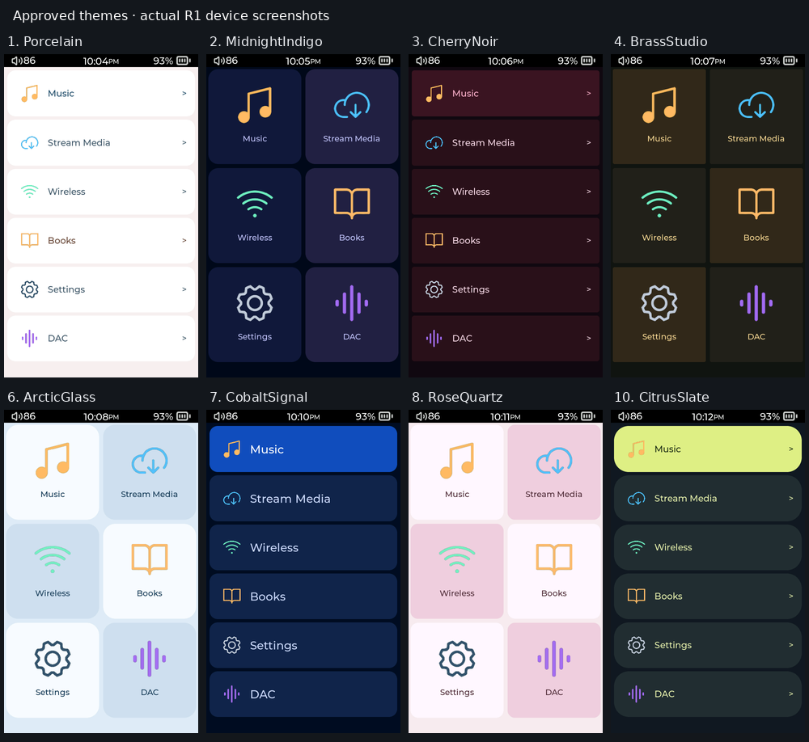

# Approved themes

Each approved theme was implemented, applied through the Theme picker on the physical R1, captured and visually compared to its approved mockup before publication. The screenshots use the Small font tier to match the mockups. Normal Medium text and the 30-second screen timeout were restored afterward; Citrus Slate remains selected.

| Proposal | Theme | Physical R1 capture | Release version |
|---|---|---|---|
| 1 | Porcelain | [Screenshot](device/01-porcelain.png) | [3.9](https://github.com/Starnished66/compas-plugins/releases/tag/v2026.10.01.2) |
| 2 | MidnightIndigo | [Screenshot](device/02-midnightindigo.png) | [3.10](https://github.com/Starnished66/compas-plugins/releases/tag/v2026.10.01.3) |
| 3 | CherryNoir | [Screenshot](device/03-cherrynoir.png) | [3.11](https://github.com/Starnished66/compas-plugins/releases/tag/v2026.10.01.4) |
| 4 | BrassStudio | [Screenshot](device/04-brassstudio.png) | [3.12](https://github.com/Starnished66/compas-plugins/releases/tag/v2026.10.01.5) |
| 6 | ArcticGlass | [Screenshot](device/06-arcticglass.png) | [3.13](https://github.com/Starnished66/compas-plugins/releases/tag/v2026.10.01.6) |
| 7 | CobaltSignal | [Screenshot](device/07-cobaltsignal.png) | [3.14](https://github.com/Starnished66/compas-plugins/releases/tag/v2026.10.01.7) |
| 8 | RoseQuartz | [Screenshot](device/08-rosequartz.png) | [3.15](https://github.com/Starnished66/compas-plugins/releases/tag/v2026.10.01.8) |
| 10 | CitrusSlate | [Screenshot](device/10-citrusslate.png) | [3.16](https://github.com/Starnished66/compas-plugins/releases/tag/v2026.10.01.9) |

The final Themes 3.16 catalog includes all eight themes. Release asset SHA-256 values and comparison notes are recorded in [release-validation.json](release-validation.json). Status values are live; RGB565 hardware introduces small color quantization differences.

## Other screen sizes

The [gallery](index.html) contains Home renders using the actual layout builder at R1 480×800, R3 Pro II 480×720 and R3 2025 320×480. Those are host renders, not physical R3 captures. All 72 Small-tier layouts passed row and label bounds checks. Another 48 renders checked the approved themes at Medium and Large; glyphs remained within their tiles. Large R3 Pro II grid label object boxes extend past their cells, but rendered glyphs fit and do not overlap adjacent rows.

Blueprint (5) and Ink Paper (9) remain unapproved drafts and are absent from the released plugin catalog. Existing-theme contrast edits remain pending locally. The plugin interface is unchanged.
