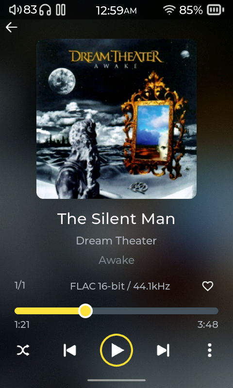
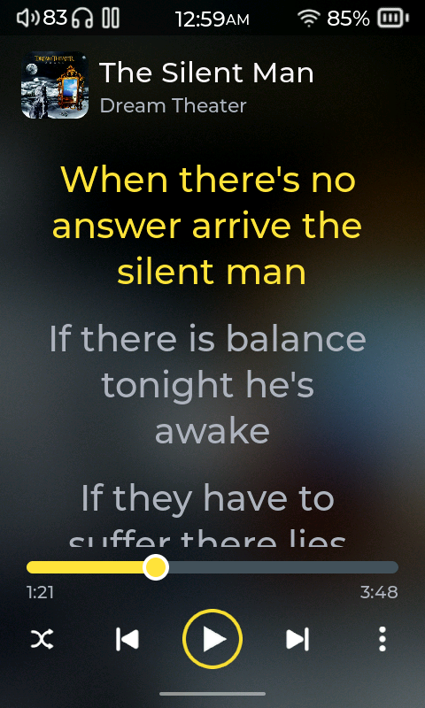

# Gallery Player

Gallery uses a frosted artwork background, centered playback metadata, five evenly spaced transport controls, and cover-tap lyrics with the title and artist aligned beside the thumbnail. It reuses the player's stock icons.

Install **Gallery Player** from the Plugin Store, then select it under **Settings > Display > Player Layout > Layout**. The plugin is published in [compas-plugins](https://github.com/Starnished66/compas-plugins/tree/main/plugins/GalleryPlayer). It requires Plugin API 15 or newer, which guarantees the XML lyrics-area support and board-size variant discovery used by the layout.

The player also ships `gallery.xml`, with variants for R1 (480×800), R3 Pro II (480×720), and R3 II 2025 (320×480). All three variants passed real LVGL layout checks. A clean source snapshot containing the Gallery support passed a full R1 target build. Device screenshots use the SD card's **The Silent Man — Dream Theater**, paused with its existing synced lyrics.

