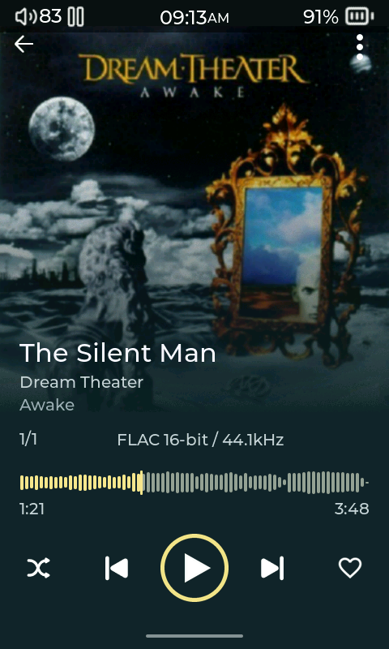
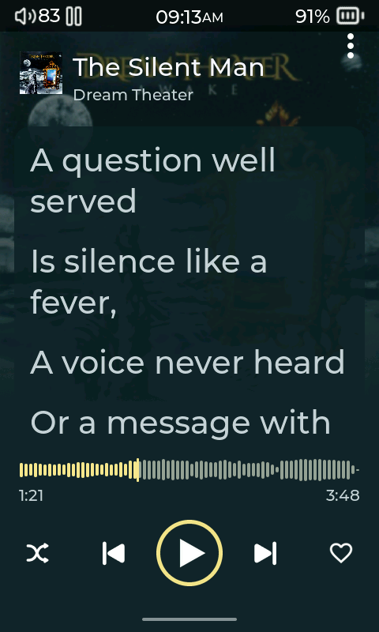

# Panorama Player

Panorama places artwork behind the track information, with a dithered fade into the background, rounded waveform bars and five evenly spaced playback controls. Tap the cover to open lyrics. The layout reuses the player’s existing icons.

Install **Panorama Player** from the [Plugin Store](https://github.com/Starnished66/compas-plugins/tree/main/plugins/PanoramaPlayer), then select it under **Settings > Display > Player Layout > Layout**. Use a current player build containing the waveform and cover fade support.

Variants fit R1 (480×800), R3 Pro II (480×720) and R3 II 2025 (320×480). Waveforms are generated asynchronously for supported local tracks and cached on the SD card. A standard slider remains available while loading or when a track cannot provide a waveform.

